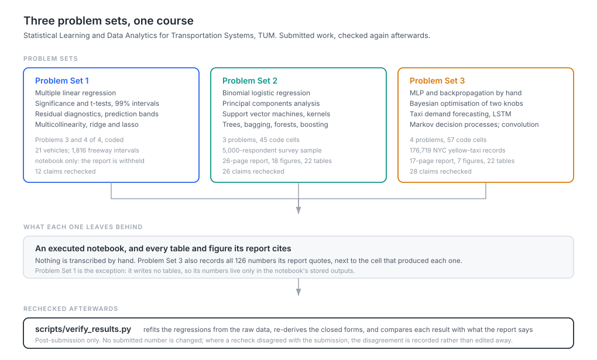

# Statistical Learning and Data Analytics for Transportation Systems

Coursework for *Statistical Learning and Data Analytics for Transportation
Systems*, M.Sc. Mathematics in Science and Engineering, Technical University of
Munich, Chair of Transportation Systems Engineering. Three graded problem sets,
submitted between May and August 2026.

This is university coursework. It is not a research contribution, not a
deployed system, and not commercial work. What it is good for is showing method
worked end to end: each problem set carries its executed notebook, the report it
produced, and every table and figure that report cites.



## What this repository contains

| | Topics | What is published |
|---|---|---|
| **Problem Set 1** | Multiple linear regression, significance and t-tests, residual diagnostics, multicollinearity, ridge and lasso | Notebook and data. The report is withheld. |
| **Problem Set 2** | PCA, binomial logistic regression, SVMs and kernels, decision trees, bagging, random forests, gradient boosting | Notebook, 26-page report and its LaTeX source, 18 figures, 22 tables |
| **Problem Set 3** | Neural networks and backpropagation, Bayesian optimisation, sequence forecasting, Markov decision processes, 2-D convolution | Notebook, 17-page report and its LaTeX source, 7 figures, 22 tables, a registry of every quoted number |

**Problem Set 1's report is not here.** It carries the matriculation number on
its title page and, unlike the other two, has no LaTeX source in the repository
to rebuild a redacted copy from, so it is excluded by `.gitignore` rather than
redacted. The notebook is the only solution artifact in that folder.

## Task inventory

| Set | Problem | Objective | Method | Data | Evaluation |
|---|---|---|---|---|---|
| 1 | 3 | Predict highway fuel economy | OLS on six engine and vehicle variables | 21 vehicles, supplied | F-test, t-tests, 99% intervals, residual plots, prediction bands |
| 1 | 4 | Predict freeway segment speed | OLS, then ridge and lasso with cross-validated penalty | 1,816 five-minute intervals, supplied | VIF, adjusted R-squared, coefficient comparison |
| 2 | 1 | Compare two mode-choice specifications; reduce five correlated variables | Binomial logit; PCA on the standardised predictors | 5,000-respondent survey sample, supplied | BIC and likelihood ratio; scree, loadings, communalities |
| 2 | 2 | Separate eight points; build a kernel | Convex-hull argument, soft-margin SVM, explicit feature map | 8 points from the sheet | Margin, support vectors, Gram matrices |
| 2 | 3 | Split criteria, bagging arithmetic, and a delay classifier | Entropy and Gini, bootstrap expectations, tree, random forest, gradient boosting | 12 points from the sheet; 1,200 synthetic incidents | Cross-validated ROC-AUC on training only, then one test evaluation |
| 3 | 1 | Complete an MLP and tune it | Backpropagation derived by hand; Bayesian optimisation against random search | 200 concentric-circle points | Finite differences and autograd; 3-fold CV objective |
| 3 | 2 | Forecast taxi demand | Persistence and seasonal baselines, MLP, 1-D CNN, LSTM | 176,719 NYC yellow-taxi records, supplied | Chronological split, validation-only selection, October unsealed once |
| 3 | 3 | Solve a charging-station MDP | Discounted return, uniform policy, iterative policy evaluation, greedy improvement | Graph from the sheet | Exact arithmetic, fractions kept unrounded |
| 3 | 4 | Convolution | Manual convolution, an implementation from scratch, Sobel edges | 81 verification cases | Compared against a reference implementation |

## Data

Every dataset was supplied with its assignment. The problem sheets do not name
a public source for the regression, survey or incident data, so none is claimed
here. The taxi file is described in the sheet as NYC yellow-taxi records for May
to October.

The Problem Set 2 incident data for Problem 3.4 is generated inside the notebook
with a fixed seed; the sheet asks for exactly that, and the notebook says so.
Nothing else in this repository is synthetic.

`Assignment_3/mlp.py` is the course's own skeleton, with the five
`### YOUR CODE STARTS HERE ###` gaps as supplied. The completed version is a
separate file, `Assignment_3/solution/mlp.py`, which keeps those markers around
the filled-in regions and opens with a docstring listing every change. The two
can be diffed.

## Verified results

The notebooks already write every table and figure their reports cite, and
Problem Set 3 records all 126 numbers its report quotes. What none of that does
is check the other direction: that the prose still says what the artifacts say.

`scripts/verify_results.py` recomputes 66 claims and compares each with the
figure the report gives. Where a claim has a closed form, it is derived rather
than read from a file.

| | Checks | Passed | How |
|---|---|---|---|
| Problem Set 1 | 12 | 12 | Both regressions refit from the supplied CSVs; the notebook is not trusted at all |
| Problem Set 2 | 26 | 26 | Log-likelihoods re-derived from the BIC values in the sheet; split impurities, bootstrap expectations and F1 scores recomputed |
| Problem Set 3 | 28 | 28 | Registry checked against the result tables; the MDP return, the convolution sign and the gradient checks re-derived |

All 126 Problem Set 3 registry values appear verbatim in the report PDF.

Re-execution was checked for Problem Sets 1 and 2. Problem Set 2 is exact: all
45 code-cell outputs and all 22 result tables come back byte-identical on a
newer scikit-learn than the one that produced them. Problem Set 1 reproduces
except for the single value below.

Problem Set 3 was re-executed end to end on a different PyTorch backend than
the one that produced it: CPU under `torch 2.11.0+xpu`, against the CUDA machine
the notebook was written on. Nine of its 23 tables come back byte-identical, and
they are exactly the ones that involve no training: the whole of the data
cleaning and splitting in Problem 2.1, the frozen-pipeline record, and all four
Markov decision process tables in Problem 3.

The trained models move. On the sealed October test set the LSTM gives a mean
absolute error of 6.722 against the 6.688 in the report, a difference of half a
percent, while all three baselines are byte-identical because none of them
trains anything. The conclusion is unchanged: the LSTM still beats persistence,
the seasonal naive and the historical average by the same wide margin.

The validation-stage tables move more, because they compare configurations that
were close to begin with and a small shift reorders near-ties. The notebook
already warns about this for the 1-D CNN, which lands within about 0.03
validation MAE because `Conv1d` backward accumulates with atomics; running on a
different backend widens that to the whole training path rather than the CNN
alone.

None of this is a defect. It is what neural network training does across
hardware, and it is the reason Problem Set 3 records the numbers it quotes in a
registry rather than relying on a re-run to confirm them.

### One value that no longer reproduces

Problem Set 1 reproduces except for the variance inflation factor of the
constant column in Section 4.2, which was `1961.68748` when the notebook ran and
is `1.00000` on a current `statsmodels`. The library changed how it treats an
intercept. The four real predictors are unchanged, and the notebook already says
the constant's VIF has no meaning and ignores it, so no conclusion moves.

The submitted output is left as it was. This is recorded here rather than
edited, which is the rule this repository follows for everything below.

## Post-submission notes

The work was submitted as it stands. Everything added afterwards is
verification and packaging, kept separate from the submission:

- `scripts/verify_results.py` and `verification/verification.json`, added after
  submission. No submitted number was changed by them.
- `tests/` and the CI workflow, which check the committed artifacts for internal
  consistency.
- `Assignment_1/README.md` and `Assignment_1/requirements.txt`, which were
  missing. The root README had claimed every folder carried a requirements file.
- One duplicate removed: `nyc-yellow-may2oct.csv` was committed twice,
  byte-identical, once beside the problem sheet and once under `solution/data/`.
  The `solution/data/` copy is kept, matching how Problem Set 2 stores its data.
- Three descriptions corrected in the assignment READMEs, which had drifted from
  the folders they describe: Problem Set 2's tree showed a `Solution/` directory
  that does not exist under that name, and Problem Set 3's said its `figures/`
  folder is absent, which was true of the submitted archive but not of this
  repository.

Nothing inside the submission was rewritten: no result, figure, report, notebook
output or line of solution code was altered. The reports and notebooks keep the
punctuation and wording they were handed in with, including the em dashes this
repository's own newer writing avoids.

## Layout

```
Assignment_1/            notebook, problem sheet, supplied data
Assignment_2/            notebook, report (+ .tex), problem sheet, data/, figures/, results/
Assignment_3/            problem sheet, the supplied mlp.py skeleton
  solution/              notebook, report (+ .tex), completed mlp.py, data/, figures/, results/
docs/diagrams/           the overview figure above
scripts/verify_results.py
tests/
verification/            verification.json, written by the script
```

Each assignment folder carries its own `README.md` and `requirements.txt`.

## Reproducing

```bash
pip install -r Assignment_2/requirements.txt
jupyter lab Assignment_2/Problem_Set_2_Notebook.ipynb
```

Paths inside the notebooks are relative to the notebook's own folder. Each is
stored with its outputs, so none needs to be re-run in order to be read.

Problem Set 2 runs in about a minute. Problem Set 3 takes roughly an hour on a
CUDA GPU and considerably longer on CPU: the Bayesian optimisation evaluates a
3-fold cross-validated objective 50 times, and Problem 2.2 compares three
architectures, sweeps the lookback of the winner, re-compares at the selected
lookback and repeats the top two over three seeds.

To run the post-submission checks, which need no GPU and take seconds:

```bash
python scripts/verify_results.py
python -m unittest discover -s tests
```

Reports are rebuilt from their `.tex` sources with `pdflatex`, run twice so
cross-references resolve.

## Provenance

Written by Mohd Zamin Quadri, except where stated:

- The problem sheets in each folder are the chair's own material. They are
  included for context and remain the chair's property. They are not licensed
  for redistribution by this repository.
- `Assignment_3/mlp.py` is the course's skeleton, unmodified.
- All datasets were supplied with the assignments.
- Libraries: numpy, pandas, matplotlib, seaborn, scipy, scikit-learn,
  statsmodels, PyTorch, scikit-image.

The matriculation number is not published. `build_zip.py` reads it from a
`MATRIC` environment variable if the submission archive is rebuilt.

## Limitations

Three problem sets are three problem sets. Each was written to a deadline
against a fixed brief, and the scope is the brief's, not a design choice.

Problem Set 1 has no report and no result tables in this repository, so its
numbers can be checked only by refitting from the data, which is what the
verification script does.

Problem Set 3's 1-D CNN reproduces only to about 0.03 in validation MAE, because
`Conv1d` backward on CUDA accumulates with atomics. The selected model is an
LSTM, which reproduces exactly, and no reported test figure depends on the CNN.
This is documented in the notebook and was known at submission.

## Licence

Coursework, published for reference. Please do not submit it as your own.
